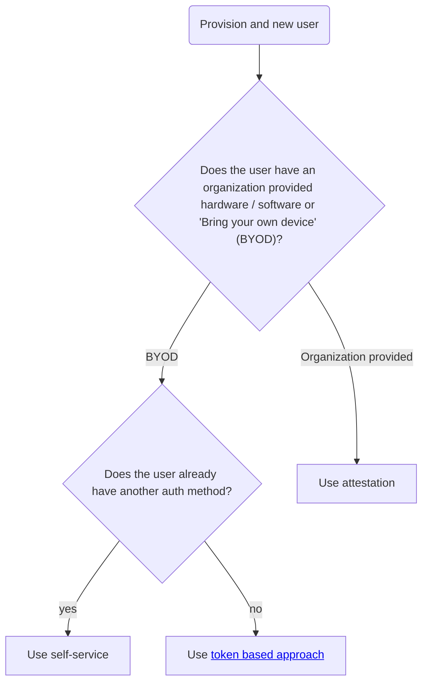

# How to onboard a new users



## Self-Service <a name="provision-self-service"></a>

To allow self-service, an identity admin needs to:

- Find the entity id of the target user (or create an entity, if the user never
  logged-in before.
- Find the fido2 mounts accessor.
- Create an alias for the fido2 mounts accessor mapping to the same entity.

Example when using userpass for user "alice" and mounting the fido2 plugin at "passkey":

```bash
USERPASS_ACCESSOR=$(bao read --field=accessor sys/auth/userpass)
FIDO2_ACCESSOR=$(bao read --field=accessor sys/auth/passkey)

ENTITY_ID=$(bao write --field=id identity/lookup/entity \
    alias_mount_accessor=$USERPASS_ACCESSOR \
    alias_name=alice)

bao write identity/entity-alias \
    canonical_id=$ENTITY_ID \
    mount_accessor=$FIDO2_ACCESSOR \
    name=alice
```

## Single use tokens  <a name="provision-token"></a>
